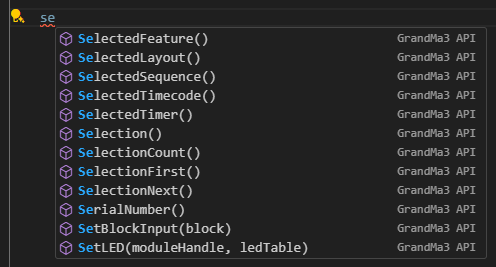
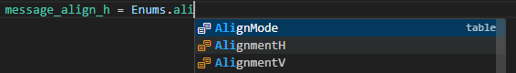
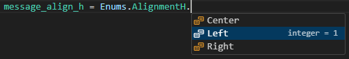
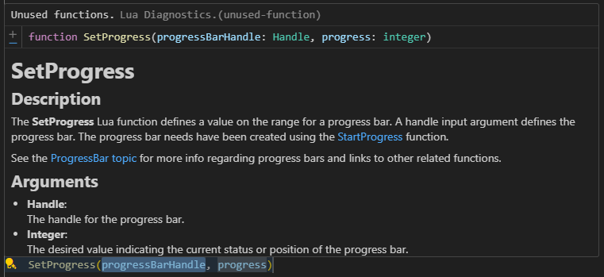
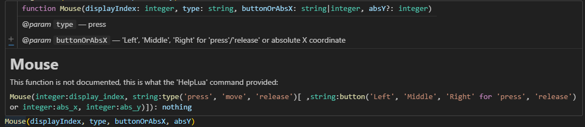
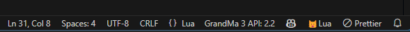
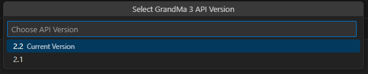
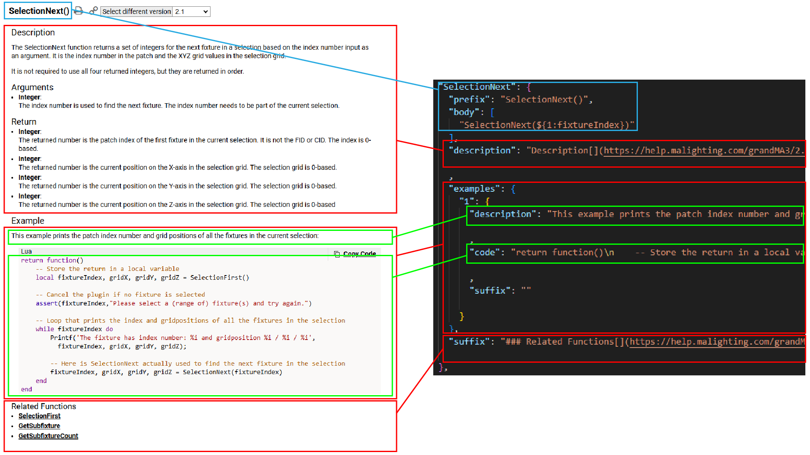

# Ma3 Lua API
A VS Code extension for the Grand Ma 3 Lua Api, it provide autocomplete and documentation for functions to write Grand Ma 3 plugins.

### Suggestions:
When typing the extension provide functions related to the selected API version.

### Autocomplete:
When you select a suggested function, the extension add automatically functions parameters.

Autocomplete are available for Enums and keys:

### Documentation:
The extension provide documentation and examples with a mouse over popup.

The extension also references functions that are not documented in the official manual, so the popup displays the description provided by the HelpLua command.

### API version selection:
The VS Code bottom toolbar display the actual Ma3 API version.

You can change it by click on id and select the version you need:

# How to contribute
This is an open source project, feel free to contribute by making pull requests.

### What do you need:

 - [VS Code IDE](https://code.visualstudio.com/download)
 - [Node JS](https://nodejs.org/en/download)
 - Clone this repository 

### File organization
All the extension data is in the resources folder, that folder contain a folder for each Ma3 version, each folder contain:

- Dummy lua files to helps the Lua Language Server to know all the functions:
  - Function documented in the manual
    - [ma3_dummy_object_free.lua](resources/2.1/ma3_dummy_object_free.lua) : object free functions
    - [ma3_dummy_object.lua](resources/2.1/ma3_dummy_object.lua) : object functions
  - Function not documented in the manual but returned by the [HelpLua](https://help.malighting.com/grandMA3/2.1/HTML/keyword_helplua.html) command
    - [ma3_dummy_object_free_no_doc.lua](resources/2.1/ma3_dummy_object_free_no_doc.lua) : object free functions 
    - [ma3_dummy_object_no_doc.lua](resources/2.1/ma3_dummy_object_no_doc.lua) : object functions 
  - [ma3_enums.lua](resources/2.1/ma3_enums.lua) : Enums list returned by this [lua script](utils/GenerateEnumsFile/exportEnumList.lua) and converted to lua enum with this [Python script](utils/GenerateEnumsFile/GenerateLuaEnums.py)
- Json files that contain all object api documentation and autocompletion:
  - Function documented in the manual
    - [ma3_object_free.json](resources/2.1/ma3_object_free.json) : object free functions
    - [ma3_object.json](resources/2.1/ma3_object.json) : object functions
  - For not documented functions
    - [ma3_object_free_no_doc.json](resources/2.1/ma3_object_free_no_doc.json) : object free functions
    - [ma3_object_no_doc.json](resources/2.1/ma3_object_no_doc.json) : object functions

### To update or complete the documented files:

This image explain how to fill the json files according to the [Ma help pages](https://help.malighting.com/grandMA3/2.1/HTML/lua_objectfree.html) that corresponding to the version.

- For the body part, fill the parentheses with the function parameters like:

    function(${1:fixtureId}, ${2:count}, ${3:type})

- All the text part need to be converted to Markdown format, this can be done using this online tool: [Clipboard 2 Markdown](https://euangoddard.github.io/clipboard2markdown/).

- After that you have to convert the markdown text to a single line string, this can be done with [json Stringlfy](https://toolsaday.com/text-tools/json-stringify).

- For the code part of the example, you only have to convert to a single line string.

### To update or complete the dummy file:

This file contain dummy functions with input parameters, you have to enumerate all parameters types, if they are optional, if they can be nil and the return type:

    ---@param fixtureTableHandle Handle
    ---@param multiPatchAmount integer
    ---@param undoText? string @Optional
    ---@return integer|nil multiPatchAmountCreated
    function CreateMultiPatch(fixtureTableHandle, multiPatchAmount, undoText)
        return 0
    end 

Test your modification and then, start a pull request!

⚠ **Disclaimer**  
This extension is **not affiliated with or endorsed by MA Lighting**. It is an independent project created to provide autocomplete and documentation for the GrandMA 3 Lua API to assist in writing plugins.